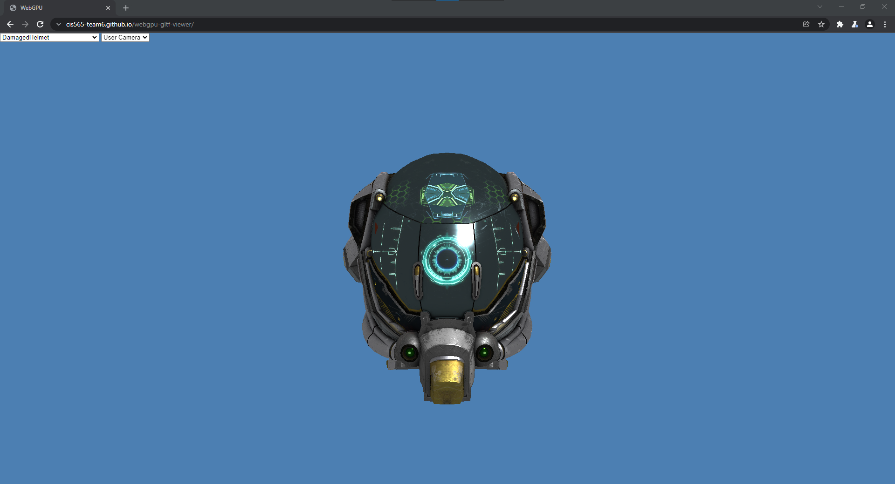
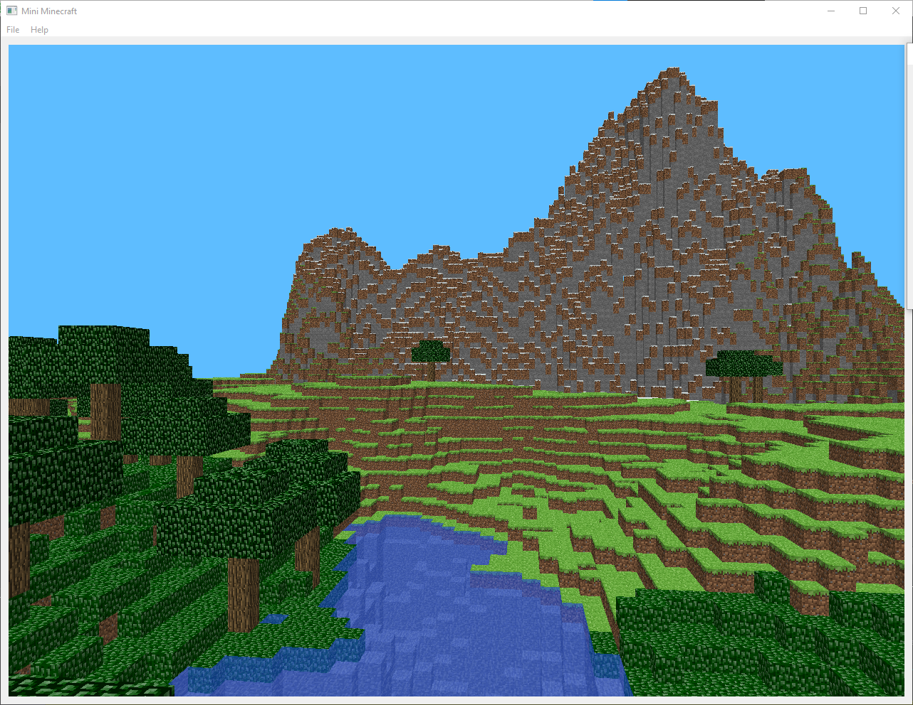
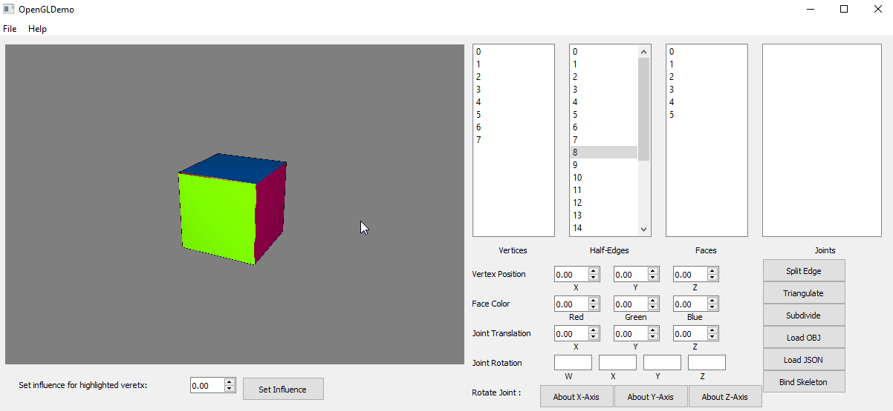

# Projects

---

[WebGPU glTF Viewer](https://github.com/cis565-team6/webgpu-gltf-viewer) (work in progress)

[live demo](https://cis565-team6.github.io/webgpu-gltf-viewer/) (requires Chrome Canary with webgpu flag enabled)

---

[CUDA Path Tracer](https://github.com/JiyuHuang/Project3-CUDA-Path-Tracer)

---

[WebGL Forward+ and Clustered Deferred Rendering](https://github.com/JiyuHuang/Project5-WebGL-Forward-Plus-and-Clustered-Deferred/) ([live demo](https://jiyuhuang.github.io/Project5-WebGL-Forward-Plus-and-Clustered-Deferred/))

---

[Mini Minecraft](https://github.com/JiyuHuang/Mini-Minecraft)

---

[Micro Maya Mesh Editor](https://github.com/JiyuHuang/mesh-editor)

---

[GPU Boid Flocking Simulation](https://github.com/JiyuHuang/Project1-CUDA-Flocking)

---

[Ink-Wash Shading](https://github.com/JiyuHuang/Project1-CUDA-Flocking)

---

[OpenGL Shaders](https://github.com/JiyuHuang/opengl-shaders)

---
